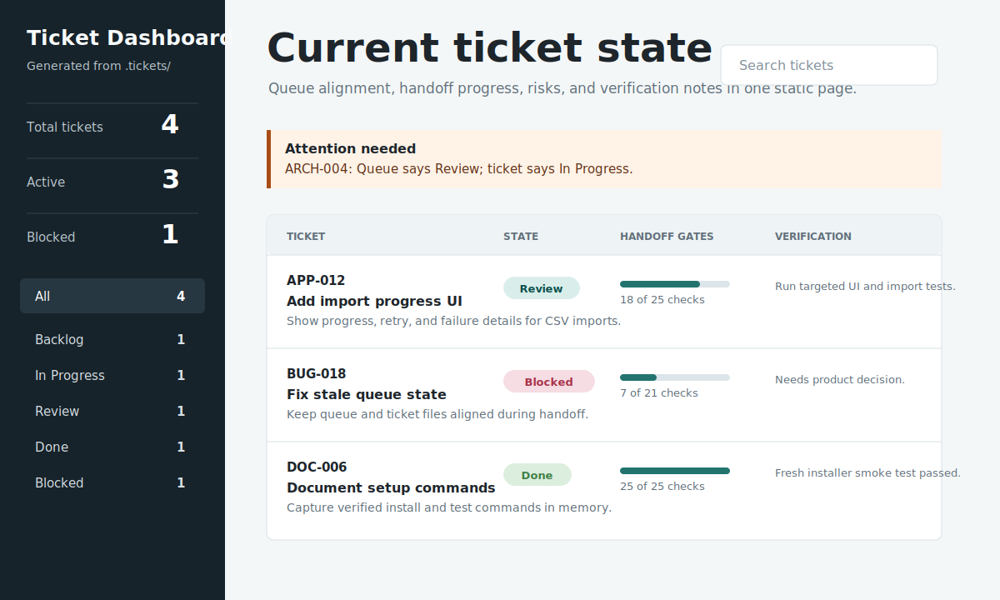

# Dev Team Agent Workflow Pack

Portable role prompts, ticket templates, and skill-routing guidance for running a multi-agent Codex workflow across projects.


## What It Installs

- `.agents/`: role definitions, project-local model config, prompts, and runbook.
- `.skills/`: skill registry and cross-skill principles.
- `.tickets/`: local ticket queue, ticket template, and starter ticket.
- `.memory/`: durable project knowledge that future agents should not rediscover.
- `scripts/render-ticket-dashboard.py`: static HTML dashboard generator for `.tickets/`.
- `docs/workflow-diagram.png` and `docs/ticket-dashboard-example.svg`: README image assets.

## Agent Roles

- Architect: plans, interrogates requirements, creates tickets, and assigns role-specific skills.
- Designer: optional UI/UX specialist for screens, flows, visual hierarchy, accessibility, and frontend polish.
- Executor: implements one scoped ticket at a time.
- Reviewer: checks spec compliance first, then code quality.
- Tester: verifies behavior with fresh evidence.

## Model Configuration

Model choices live in `.agents/models.md`.

The default profile is Codex:

- Architect: strongest reasoning model.
- Designer: strong balanced model; escalate for major UI/product decisions.
- Executor: Spark by default; escalate for broader or riskier implementation.
- Reviewer: strongest reasoning model.
- Tester: balanced model with medium effort by default.

For other providers, the installer can infer provider-class placeholders such as `anthropic-fast-coding` or `google-best-reasoning`. Replace those with exact model IDs supported by your local runner.

Executor tickets include an `Execution Model` section. Codex installs default Executor to `gpt-5.3-codex-spark` with `high` effort. Escalation must be recorded in the ticket; ordinary multi-file or integration work is not enough by itself.

## Install Into A Project

```sh
./install.sh --project /path/to/project
```

This copies `.agents`, `.skills`, `.tickets`, and `.memory` into the target project.

It also copies this pack's README as `DEV-TEAM-WORKFLOW.md`, so the target project's own `README.md` is not replaced.

By default, the installer refuses to overwrite existing workflow directories, `DEV-TEAM-WORKFLOW.md`, or `AGENTS.md`. To replace them:

```sh
./install.sh --project /path/to/project --force
```

## Use With A New Project

For a new project, install the workflow pack into the project root:

```sh
/path/to/dev-team/install.sh --project /path/to/new-project
```

During an interactive project install, the installer asks whether to import a local skill registry. Imported skill names are written to:

```text
.skills/imported.md
```

For non-interactive installs, pass a registry file explicitly:

```sh
/path/to/dev-team/install.sh --project /path/to/new-project --import-skills /path/to/local-skills.md
```

Or skip import prompts:

```sh
/path/to/dev-team/install.sh --project /path/to/new-project --no-import-skills
```

The installer also asks which model provider to use. Press enter to use the Codex defaults, or enter another provider name to generate an inferred `.agents/models.md`.

For non-interactive installs:

```sh
/path/to/dev-team/install.sh --project /path/to/new-project --models-provider codex
```

To import exact model IDs from a prepared file:

```sh
/path/to/dev-team/install.sh --project /path/to/new-project --models-file /path/to/models.md
```

To skip model prompts and use the packaged defaults:

```sh
/path/to/dev-team/install.sh --project /path/to/new-project --no-model-prompt
```

The project root will then contain:

```text
.agents/
.skills/
.tickets/
.memory/
scripts/
docs/workflow-diagram.png
docs/ticket-dashboard-example.svg
AGENTS.md
DEV-TEAM-WORKFLOW.md
```

Open Codex from that project root so it reads the installed `AGENTS.md`.

Manual copying works too, but the installer is preferred because it preserves the expected folder layout and refuses accidental overwrites.

If the target project already has its own `AGENTS.md`, review before using `--force`; it will replace that file. The installer does not replace the target project's `README.md`.

## Update An Existing Project

For projects that already use this workflow, update only the reusable workflow files:

```sh
/path/to/dev-team/install.sh --project /path/to/project --update
```

Update mode refreshes:

```text
.agents/
.skills/
scripts/render-ticket-dashboard.py
docs/workflow-diagram.png
docs/ticket-dashboard-example.svg
.tickets/README.md
.tickets/template.md
DEV-TEAM-WORKFLOW.md
```

Update mode preserves:

```text
README.md
AGENTS.md
.agents/models.md unless a new model provider or model file is provided
.tickets/queue.md
.tickets/ARCH-*.md and other project tickets
.memory/
.skills/imported.md unless a new import file is provided
```

To refresh local skill names during an update:

```sh
/path/to/dev-team/install.sh --project /path/to/project --update --import-skills /path/to/local-skills.md
```

To refresh model choices during an update:

```sh
/path/to/dev-team/install.sh --project /path/to/project --update --models-provider codex
```

Use `--force` only for a full reinstall where replacing project-local workflow state is intentional.

## Install As A Global Template

```sh
./install.sh --global
```

This installs the pack to:

```text
~/.codex/agent-workflows/dev-team
```

You can then copy it into projects later.

After global install, use the global template from any project:

```sh
~/.codex/agent-workflows/dev-team/install.sh --project /path/to/project
```

## Use In A Project

1. Ask the Architect to create tickets from the request.
2. Route UI tickets through Designer when `Designer Review` is required.
3. Assign one `Ready` ticket to Executor.
4. Run Reviewer after implementation.
5. Run Tester before marking the ticket `Done`.

The key field is `Skill Context` in each ticket. It records language, framework, platform, project type, task type, and which skills each role should use.

For UI tickets, `Skill Context` can also request product-neutral design tooling capabilities such as `design-inspection`, `design-token-extraction`, `component-reference`, `layout-comparison`, or `asset-guidance`. Any local design MCP, connector, screenshot workflow, or design document can satisfy those capabilities without making the pack depend on a specific product.

State changes are guarded by `Handoff Gates` in each ticket. The orchestrator should not move a ticket to the next state until the relevant gate is complete or explicitly waived with a reason.

The Architect should inspect project context first, then record `Questioning Notes` before execution: decision tree, blocking questions, assumptions, deferred questions, approaches considered, and the chosen approach. Tickets with unresolved blocking questions stay in `Backlog` or `Blocked`.

Use `.memory/` for durable knowledge only: verified commands, architectural decisions, project orientation, and pitfalls. Keep active task notes in `.tickets/`.

Runtime support is optional. When available, the workflow can use fresh-context subagents, live supervisor contact, background execution, and an allowed-agent list. When unavailable, agents use explicit ticket handoffs and report `NEEDS_CONTEXT` or `BLOCKED` instead of guessing.

## Render The Ticket Dashboard

Generate local HTML and Markdown summaries of the current ticket queue:

```sh
python3 scripts/render-ticket-dashboard.py
```

The command writes:

```text
docs/tickets.html
docs/tickets.md
```

Open the HTML file in a browser to scan ticket counts, current states, queue mismatches, handoff gate progress, risks, and verification notes. Use the Markdown file when working in Codex remote or another ChatGPT surface that can display Markdown inline. Re-run the command whenever ticket files or `.tickets/queue.md` change.



## Ticket Dashboard In Action

When the Architect creates or updates tickets, it should offer to render the dashboard. A typical handoff looks like this:

```text
Architect:
I created APP-012 and BUG-018, updated .tickets/queue.md, and can render the ticket dashboard if you want a quick visual scan.

Command:
python3 scripts/render-ticket-dashboard.py

Output:
docs/tickets.html
docs/tickets.md
```

The generated views are intentionally simple: the HTML page gives a searchable browser dashboard, and the Markdown file gives a compact ChatGPT-friendly summary. Both highlight state counts, ticket status, handoff progress, and warnings when `.tickets/queue.md` disagrees with a ticket file's `State`. Once the user starts using the dashboard, the Architect should refresh it after later ticket or queue updates so both files stay current.
