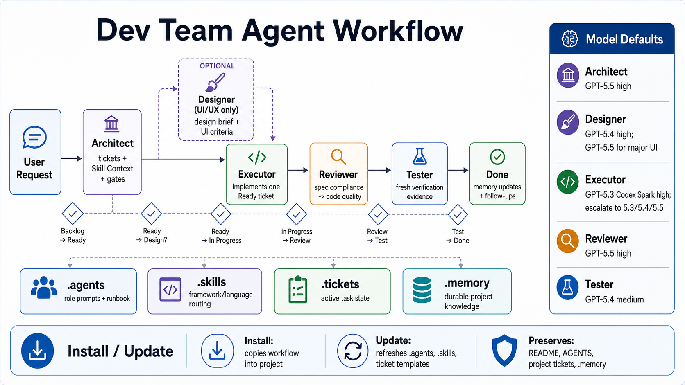

# Dev Team Agent Workflow Pack

Portable role prompts, ticket templates, and skill-routing guidance for running a multi-agent Codex workflow across projects.



## What It Installs

- `.agents/`: role definitions, model defaults, prompts, and runbook.
- `.skills/`: skill registry and cross-skill principles.
- `.tickets/`: local ticket queue, ticket template, and starter ticket.
- `.memory/`: durable project knowledge that future agents should not rediscover.

## Agent Roles

- Architect: plans, interrogates requirements, creates tickets, and assigns role-specific skills.
- Designer: optional UI/UX specialist for screens, flows, visual hierarchy, accessibility, and frontend polish.
- Executor: implements one scoped ticket at a time.
- Reviewer: checks spec compliance first, then code quality.
- Tester: verifies behavior with fresh evidence.

## Model Defaults

```text
Architect: gpt-5.5, high
Designer: gpt-5.4, high
Designer for major product/UI decisions: gpt-5.5, high
Executor default: gpt-5.3-codex-spark, high
Executor escalation: gpt-5.3-codex medium/high, gpt-5.4 high, or gpt-5.5 high for the most complex implementation work
Reviewer: gpt-5.5, high
Tester: gpt-5.4, medium
```

## Install Into A Project

```sh
./install.sh --project /path/to/project
```

This copies `.agents`, `.skills`, `.tickets`, and `.memory` into the target project.

It also copies this pack's README as `DEV-TEAM-WORKFLOW.md`, so the target project's own `README.md` is not replaced.

By default, the installer refuses to overwrite existing workflow directories, `DEV-TEAM-WORKFLOW.md`, or `AGENTS.md`. To replace them:

```sh
./install.sh --project /path/to/project --force
```

## Use With A New Project

For a new project, install the workflow pack into the project root:

```sh
/path/to/dev-team/install.sh --project /path/to/new-project
```

The project root will then contain:

```text
.agents/
.skills/
.tickets/
.memory/
AGENTS.md
DEV-TEAM-WORKFLOW.md
```

Open Codex from that project root so it reads the installed `AGENTS.md`.

Manual copying works too, but the installer is preferred because it preserves the expected folder layout and refuses accidental overwrites.

If the target project already has its own `AGENTS.md`, review before using `--force`; it will replace that file. The installer does not replace the target project's `README.md`.

## Update An Existing Project

For projects that already use this workflow, update only the reusable workflow files:

```sh
/path/to/dev-team/install.sh --project /path/to/project --update
```

Update mode refreshes:

```text
.agents/
.skills/
.tickets/README.md
.tickets/template.md
DEV-TEAM-WORKFLOW.md
```

Update mode preserves:

```text
README.md
AGENTS.md
.tickets/queue.md
.tickets/ARCH-*.md and other project tickets
.memory/
```

Use `--force` only for a full reinstall where replacing project-local workflow state is intentional.

## Install As A Global Template

```sh
./install.sh --global
```

This installs the pack to:

```text
~/.codex/agent-workflows/dev-team
```

You can then copy it into projects later.

After global install, use the global template from any project:

```sh
~/.codex/agent-workflows/dev-team/install.sh --project /path/to/project
```

## Use In A Project

1. Ask the Architect to create tickets from the request.
2. Route UI tickets through Designer when `Designer Review` is required.
3. Assign one `Ready` ticket to Executor.
4. Run Reviewer after implementation.
5. Run Tester before marking the ticket `Done`.

The key field is `Skill Context` in each ticket. It records language, framework, platform, project type, task type, and which skills each role should use.

State changes are guarded by `Handoff Gates` in each ticket. The orchestrator should not move a ticket to the next state until the relevant gate is complete or explicitly waived with a reason.

Use `.memory/` for durable knowledge only: verified commands, architectural decisions, project orientation, and pitfalls. Keep active task notes in `.tickets/`.
