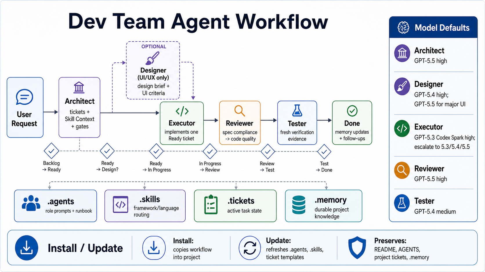
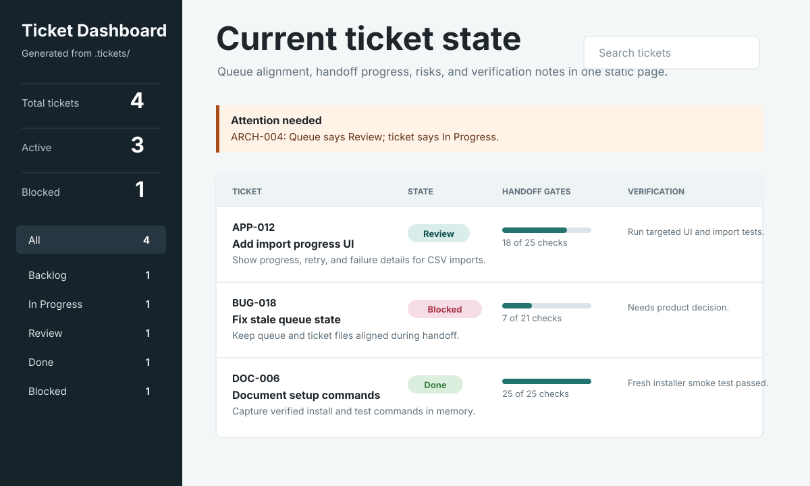

# Dev Team Agent Workflow Pack

Portable role prompts, ticket templates, and skill-routing guidance for running a multi-agent Codex workflow across projects.



## What It Installs

- `.agents/`: role definitions, project-local model config, prompts, and runbook.
- `.skills/`: skill registry and cross-skill principles.
- `.tickets/`: empty local ticket queue, reusable README and ticket template.
- `.memory/`: durable project knowledge that future agents should not rediscover.
- `scripts/render-ticket-dashboard.py`: static HTML dashboard generator for `.tickets/`.
- `scripts/check-workflow-policy.py` and `scripts/workflow_policy/`: read-only stdlib policy checks and portable content fingerprints.
- `.agents/runtime-modes.md`: explicit operating modes and Pi adapter migration checklist.
- `docs/workflow-diagram.png` and `docs/ticket-dashboard-example.svg`: README image assets.

## Agent Roles

- Architect: plans, interrogates requirements, creates tickets, and assigns role-specific skills.
- Designer: optional UI/UX specialist for screens, flows, visual hierarchy, accessibility, and frontend polish.
- Executor: implements one scoped ticket at a time.
- Reviewer: checks spec compliance first, then code quality.
- Tester: verifies behavior with fresh evidence.

## Model Configuration

Model choices live in `.agents/models.md`.

Defaults remain unchanged: Architect Luna xhigh; Designer, Executor and Tester
Terra medium; Reviewer Sonnet 4.6 medium when permitted, otherwise Terra medium;
optional Second Reviewer GPT-5.5 high. The first nine model columns retain their
legacy values. Executor/Tester economy routing is explicit, bounded mechanical
work or named deterministic verification, not diagnosis or UI judgment.

Optional fallback effort, native fallback, and escalation columns require declared
model-routing-v2 support. Architect may then use native Codex Terra high when
Luna is unavailable; the Anthropic fallback remains configured. Sol escalation
is explicit and uses the table's effort, not automatic higher-tier reasoning.
Higher tiers need an explicit project configuration decision. No Astra switch.

Official Codex/ChatGPT and Claude remain provider-local. Custom runtimes can use
only explicitly declared allowed providers. Check availability and supported
effort; confirmed exhaustion permits fallback, unknown quota does not. Transient
failures have bounded retries distinct from quota recovery. Observed inherited
models may differ from configuration: disclose deviations or Unavailable.

For exact candidates, efforts and eligibility, read [.agents/models.md](.agents/models.md).
This table is authoritative; old Pi ignores extensions until its adapter changes.

## Operating Modes

Select explicit enforced or portable mode using
[.agents/runtime-modes.md](.agents/runtime-modes.md). Enforced mode requires trusted
runner records and protected completion; the reference checker does not supply
those capabilities or authenticate data. Failed enforced gates never silently
fall back to portable operation.

Portable mode works with independent role sessions and disclosed review/test
reports in official Codex/ChatGPT. Without commit authorization, freeze ownership
and use a content-sha256 fingerprint of tracked and nonignored untracked source;
never fabricate a commit SHA or runner evidence. Missing independent sessions
keeps work blocked, never self-reviewed. Required integration precedes acceptance.
Default correction limit is two rounds, with an earlier no-progress cutoff.

`python3 -B scripts/check-workflow-policy.py --fingerprint /absolute/project --ticket-id APP-123`

`python3 -B scripts/check-workflow-policy.py --input /outside/project/attempt.json`

The read-only CLI validates supplied snapshots/records against the selected model
table. It never creates sessions, activates models, writes tickets or completes
work. Accepted results still say authenticated: false. See the evidence contract
for the input schema and runtime-modes.md for precise Pi migration gaps.

Concurrent implementation tickets use dedicated worktrees, ticket-scoped artifacts, immutable verification commits, and one post-merge integration matrix per batch. Preserve blocked or failed workspaces for diagnosis; clean up only named, merged, verified workspaces after artifact capture.

## Shared Host Resources

Worktrees isolate source and per-ticket artifact roots isolate build outputs, but some platforms also have machine-wide resources. When an applicable platform skill identifies one, run only the contended phase under the installed lease helper so unrelated work can continue in parallel:

```sh
scripts/with-host-resource-lease.sh --timeout 600 resource-name -- command [arguments]
```

The helper uses a host-wide local lease root and records the holder in an
`owner` file. It releases its own lease and safely reclaims a lease whose
numeric owner PID is no longer alive. Malformed or unverifiable owner records
remain unavailable for manual inspection.

### Apple Platform

Only Apple-platform tickets that use Xcode/CoreSimulator should apply the following build-root convention:

To keep Xcode products off the source volume, optionally configure a user-owned external build root before running agents:

```sh
export DEV_TEAM_BUILD_ROOT=/Volumes/ExternalSSD/builds
```

Verify that the volume is mounted, local, writable, outside the project repository, and has sufficient space before each build. Derive one stable path such as `$DEV_TEAM_BUILD_ROOT/<project>/<ticket>`, use its `DerivedData` child with `-derivedDataPath`, and reuse it for Executor, Reviewer, Tester, and every retry of that ticket. Never create a new artifact root per role or attempt. Do not clean an active ticket root. A missing configured build root is a blocker: do not silently fall back to Xcode's default DerivedData location.

## Install Into A Project

Run this from the root of the repo where you want the workflow installed:

```sh
curl -fsSL https://raw.githubusercontent.com/dsmailes/dev-team/main/install.sh | sh -s -- --here
```

That downloads the current pack, then installs the workflow files into the current directory.

If you already have a local checkout of this pack, you can also install into an explicit path:

```sh
./install.sh --project /path/to/project
```

This copies the workflow directories, scripts, and README image assets into the target project.

Or install from the local checkout into the current terminal directory with `--here`:

```sh
/path/to/dev-team/install.sh --here
```

It also copies this pack's README as `DEV-TEAM-WORKFLOW.md`, so the target project's own `README.md` is not replaced.

By default, the installer refuses to overwrite existing workflow directories, `DEV-TEAM-WORKFLOW.md`, or `AGENTS.md`. When it detects an existing dev-team installation, it directs you to the safe update command instead:

```sh
./install.sh --project /path/to/project --update
```

## Use With A New Project

For a new project, install the workflow pack into the project root:

```sh
/path/to/dev-team/install.sh --project /path/to/new-project
```

Or `cd` into the project and install into the current directory:

```sh
cd /path/to/new-project
curl -fsSL https://raw.githubusercontent.com/dsmailes/dev-team/main/install.sh | sh -s -- --here
```

During an interactive project install, the installer asks whether to import a local skill registry. Imported skill names are written to:

```text
.skills/imported.md
```

For non-interactive installs, pass a registry file explicitly:

```sh
/path/to/dev-team/install.sh --project /path/to/new-project --import-skills /path/to/local-skills.md
```

Or skip import prompts:

```sh
/path/to/dev-team/install.sh --project /path/to/new-project --no-import-skills
```

The installer also asks which model provider to use. Press enter to use the Codex defaults, or enter another provider name to generate an inferred `.agents/models.md`.

For non-interactive installs:

```sh
/path/to/dev-team/install.sh --project /path/to/new-project --models-provider codex
```

To import exact model IDs from a prepared file:

```sh
/path/to/dev-team/install.sh --project /path/to/new-project --models-file /path/to/models.md
```

To skip model prompts and use the packaged defaults:

```sh
/path/to/dev-team/install.sh --project /path/to/new-project --no-model-prompt
```

The project root will then contain:

```text
.agents/
.skills/
.tickets/
.memory/
scripts/
docs/workflow-diagram.png
docs/ticket-dashboard-example.svg
AGENTS.md
DEV-TEAM-WORKFLOW.md
```

Open Codex from that project root so it reads the installed `AGENTS.md`.

Manual copying works too, but the installer is preferred because it preserves the expected folder layout and refuses accidental overwrites.

`--force` never replaces project state by itself. A full reset is intentionally separate and requires both `--reset-project-state --force`; it previews every affected path, asks for confirmation, and creates a timestamped backup. The installer does not replace the target project's `README.md`.

## Update An Existing Project

For projects that already use this workflow, update only the reusable workflow files:

```sh
/path/to/dev-team/install.sh --project /path/to/project --update
```

From the project directory:

```sh
curl -fsSL https://raw.githubusercontent.com/dsmailes/dev-team/main/install.sh | sh -s -- --here --update
```

Update mode refreshes:

```text
.agents/
.skills/
scripts/render-ticket-dashboard.py
scripts/check-workflow-policy.py
scripts/workflow_policy/
scripts/with-host-resource-lease.sh
docs/workflow-diagram.png
docs/ticket-dashboard-example.svg
.tickets/README.md
.tickets/template.md
DEV-TEAM-WORKFLOW.md
```

Update mode preserves:

```text
README.md
AGENTS.md
.agents/models.md unless a new model provider or model file is provided
.tickets/queue.md
.tickets/ARCH-*.md and other project tickets
.memory/
.skills/imported.md unless a new import file is provided
```

To refresh local skill names during an update:

```sh
/path/to/dev-team/install.sh --project /path/to/project --update --import-skills /path/to/local-skills.md
```

To deliberately replace the model configuration during an update:

```sh
/path/to/dev-team/install.sh --project /path/to/project --update --models-provider codex
```

This command intentionally replaces `.agents/models.md`. A plain `--update` preserves custom model configuration, including legacy files without extension columns.

Updates also preserve installed `AGENTS.md`. Existing users must manually merge the new `.agents/runtime-modes.md` guidance into their project instructions when needed; the installer will not overwrite them. Enabling model-routing-v2 is a separate adapter/configuration decision, not an effect of updating files.

Preview any installation, update, or reset without changing files:

```sh
/path/to/dev-team/install.sh --project /path/to/project --update --dry-run
```

To completely reset installed workflow state, use the explicit destructive command. It prints every affected path, requires an interactive `RESET` confirmation, and saves a timestamped backup inside the project first:

```sh
/path/to/dev-team/install.sh --project /path/to/project --reset-project-state --force
```

## Install As A Global Template

```sh
./install.sh --global
```

This installs the pack to:

```text
~/.codex/agent-workflows/dev-team
```

You can then copy it into projects later.

After global install, use the global template from any project:

```sh
~/.codex/agent-workflows/dev-team/install.sh --project /path/to/project
```

Or from inside the project:

```sh
~/.codex/agent-workflows/dev-team/install.sh --here
```

## Use In A Project

For non-trivial implementation work, use the ticket workflow by default. The Architect should create or update tickets after inspecting project context and resolving blocking questions; it does not need to ask permission to create tickets when the workflow applies.

Skip tickets only for simple explanations, one-command lookups, tiny typo fixes, or when the user explicitly asks not to use tickets.

1. Ask the Architect to inspect context and create or update tickets from the request.
2. Route UI tickets through Designer in the `Design` state when `Designer Review` is required, then return them to `Ready`.
3. Assign one `Ready` ticket to Executor.
4. Run Reviewer after implementation.
5. Run independent Tester, then required integration, before mode-specific acceptance/completion.

The key field is `Skill Context` in each ticket. It records language, framework, platform, project type, task type, and which skills each role should use.

For UI tickets, `Skill Context` can also request product-neutral design tooling capabilities such as `design-inspection`, `design-token-extraction`, `component-reference`, `layout-comparison`, or `asset-guidance`. Any local design MCP, connector, screenshot workflow, or design document can satisfy those capabilities without making the pack depend on a specific product.

State changes are guarded by `Handoff Gates` in each ticket. The orchestrator should not move a ticket to the next state until the relevant gate is complete or explicitly waived with a reason.

The Architect should inspect project context first, then record `Questioning Notes` before execution: decision tree, blocking questions, assumptions, deferred questions, approaches considered, and the chosen approach. Tickets with unresolved blocking questions stay in `Backlog` or `Blocked`.

The individual `.tickets/*.md` files plus `.tickets/queue.md` are the only authoritative live board. Runtime records under `.dev-team/` are execution history and evidence; generated `docs/tickets.*` files are snapshots. Neither is a second source of ticket state.

Ticket IDs are allocated by scanning `.tickets/*.md` and choosing the next unused numeric suffix for the selected prefix. Keep the filename, H1, `## ID`, ticket `State`, and `.tickets/queue.md` entry aligned. The value under `## State` must be one exact lifecycle token; put closure or blocker prose in a separate section. Fresh installs have an empty board; create the first real ticket from the template.

Use `.memory/` for durable knowledge only: verified commands, architectural decisions, project orientation, and pitfalls. Keep active task notes in `.tickets/`.

When a ticket reaches `Done`, the harness announces its `Agent Run Summary`: every role that ran, the agent or task identity, actual model and effort, and token usage when the runtime exposes it. If token telemetry is unavailable, the summary says `Unavailable`; it never estimates usage. This summary is not handoff proof. Enforced mode requires runner-generated records and runner completion; portable mode uses independent reports and explicit acceptance as documented in `.agents/runtime-modes.md`. Neither permits self-review or fabricated telemetry.

Runtime support is optional. When available, the workflow can use fresh-context subagents, live supervisor contact, background execution, and an allowed-agent list. When unavailable, agents use explicit ticket handoffs and report `NEEDS_CONTEXT` or `BLOCKED` instead of guessing.

## Concurrent Ticket Work

Classify each ticket as `read-only` or `mutating/building` before concurrent work starts. Record an execution mode in the ticket: `isolated` when the runtime can safely provide separate ticket branches/worktrees, or `serialized` when it cannot. Read-only investigation can remain parallel when it does not alter shared state.

In isolated mode, every concurrent mutating/building ticket gets a unique branch, worktree, scoped ticket commit, and one repository-external artifact root. The root is keyed by project and ticket, not role, session, retry, test variant, or model. Executors hand off the immutable commit ID; Reviewer and Tester verify that exact commit in clean ticket verification worktrees while reusing the same ticket artifact root, never a moving shared tree. Use project-native output controls. For example, an Xcode project can use the `DerivedData` child under its ticket-scoped artifact root, but no particular build tool or runtime is required.

After focused review and verification, the orchestrator combines the reviewed commits into an integration batch and records its integration commit. Run one full integration matrix for that merged batch, then link its result to each included ticket. Preserve blocked or failing workspaces and their ticket artifacts for diagnosis. After a ticket is accepted and concise durable evidence is recorded, remove disposable build products, intermediates, caches, package checkouts, logs, and redundant result bundles from its owned artifact root. Accepted source assets remain in source control; evidence summaries remain in runner history. Clean up only named, ownership-verified roots and clean ticket worktrees/branches. Remove unmerged work only when intentionally abandoned, and revert integrated work with a new scoped revert commit rather than resetting shared history.

## Render The Ticket Dashboard

Generate local HTML and Markdown summaries of the current ticket queue:

```sh
python3 scripts/render-ticket-dashboard.py
```

The command writes:

```text
docs/tickets.html
docs/tickets.md
```

Open the HTML file in a browser to scan ticket counts, current states, queue mismatches, handoff gate progress, risks, and verification notes. Use the Markdown file when working in Codex remote or another ChatGPT surface that can display Markdown inline. These files are generated projections, not live state: regenerate both after every ticket or queue mutation and never use an older copy to answer a status question.

Validate ticket and queue consistency:

```sh
python3 scripts/render-ticket-dashboard.py --validate
```



The HTML page gives a searchable browser projection, and the Markdown file gives a compact ChatGPT-friendly projection. Both highlight state counts, ticket status, handoff progress, and warnings when `.tickets/queue.md` disagrees with a ticket file's `State`. The Architect refreshes both immediately after every board mutation. For ordinary status, all harnesses read the live queue and ticket files directly.

A completed ticket's handoff also announces a compact run summary, for example:

```text
Agent Run Summary
- Executor: task `executor-01`; model `terra`; effort `medium`; tokens `Unavailable`.
- Reviewer: task `reviewer-01`; model `terra`; effort `medium`; tokens `12,450`.
- Tester: task `tester-01`; model `terra`; effort `medium`; tokens `Unavailable`.
```

## License

MIT. See [LICENSE](LICENSE).
